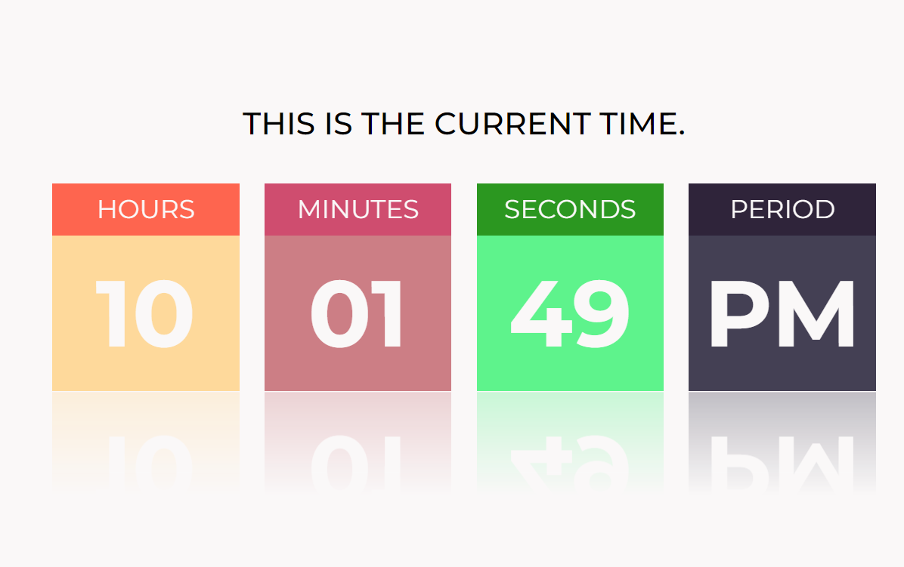

# Digital Clock

This is a simple digital clock project implemented using HTML, CSS, and JavaScript. The clock displays the current time in four separate boxes positioned in the center of the webpage. The boxes show the hour, minute, second, and the period (AM or PM).

## Project Features

- The clock is designed using HTML and styled with CSS to create a clean and modern look.
- JavaScript is used to fetch the current time from the user's device and update the clock in real-time.
- The hour is displayed in a 12-hour format with leading zeros if necessary, while the minutes and seconds are shown with leading zeros.
- The period (AM or PM) is dynamically determined based on the current time.
- The clock is positioned at the center of the page to ensure visibility and aesthetics.

## How to Use

- To use the digital clock, simply open the index.html file in a web browser.
- The clock will automatically start displaying the current time.
- The hour, minute, second, and period will update in real-time.

## Technologies Used

- HTML
- CSS
- JavaScript

## License

This project is licensed under the [MIT License](LICENSE).
